# Parcel Tracking Platform – Unified Architecture Document – Final Architecture & System Design (Complete)

Author: Sudhavamsikiran Damojipurapu

This document contains the **complete architecture specification** for the Parcel Tracking System including advanced production diagrams used in enterprise logistics systems.
Github repos
front- end : <li>[https://github.com/sudhavamsikiran/parcel-tracking-ui](https://github.com/sudhavamsikiran/parcel-tracking-ui)</li>
Back end : <li>[https://github.com/sudhavamsikiran/ParcelTrackingService](https://github.com/sudhavamsikiran/ParcelTrackingService)</li>
---

# 1. Introduction

The Parcel Tracking Platform is a cloud-native, event-driven system designed to process and track parcel lifecycle events across logistics networks. The platform ingests parcel scan events from multiple sources, validates business rules, persists event history, and exposes APIs and user interfaces for real-time parcel tracking.

The system is designed for high throughput environments such as courier and logistics companies, with a target ingestion capacity of 5000 events per second.

Key characteristics:

- Event‑driven processing
- Horizontally scalable
- Cloud native architecture
- Fault tolerant pipelines

Target throughput: **5000 events/sec**

Technology stack:
The architecture leverages modern cloud technologies including:

- visual studio 2026 IDE and features
- .NET 10 Web API
- Apache Kafka / Azure Event Hub
- Azure Cosmos DB
- React + TypeScript
- Docker & Kubernetes
- The architecture follows:
- Event-Driven Architecture
- Clean Architecture
- Domain Driven Design
- Microservice-ready design
**These architectural principles ensure**:
- High scalability
- Loose coupling
- Maintainability
- Observability

**Cloud readiness**
- Azure event hubs
- Apache Kafka
- Azure Cosmos DB
- Docker
- Kubernetes

---

# 2. Problem Statement

Logistics companies process millions of parcel events daily. Each parcel progresses through multiple lifecycle stages such as collection, sorting, dispatch, and delivery.
The platform must have below 
- ingest scan events
- validate business rules
- maintain parcel lifecycle
- persist event history
- provide real‑time tracking APIs
- notify sender/receiver
  
**Challenges addressed by the system include:**

- Event Ingestion
- Scanner devices generate scan events at high frequency across distribution centers.
- Lifecycle Tracking
- Each parcel must maintain a consistent lifecycle history.
- Real-time Status
- Customers must be able to track parcel status in near real time.
- Notification Systems
- Senders and receivers need notifications for status updates.
- High Throughput Requirements

**The system must support:**

Up to 5000 events per second

Low latency processing

Fault tolerant event processing

Scalable storage
---

# 3. Scope

Included:

- parcel lifecycle tracking
- event ingestion pipeline
- business rule validation
- notification service
- tracking API
- event streaming infrastructure

---

# 4. Out of Scope

- courier mobile apps
- AI delivery predictions
- route optimization engines
- billing systems
These features can be added in future system expansions.
---

# 5. High Level Architecture

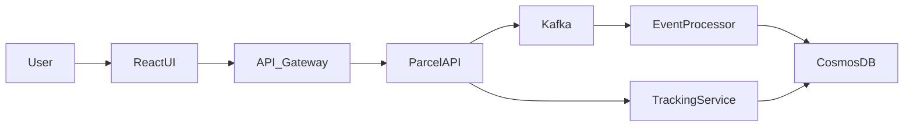

---

# 6. Architecture Patterns

### Event Driven Architecture

Events are streamed through Kafka enabling asynchronous processing.

Benefits:
- scalability
- decoupling
- fault tolerance

### Clean Architecture

Separates application layers.

Benefits:
- maintainability
- testability
- infrastructure independence

### Domain Driven Design

Domain entities represent logistics concepts.

Examples:
- Parcel
- ParcelEvent
- ParcelStatus

---

# 7. Clean Architecture Layers

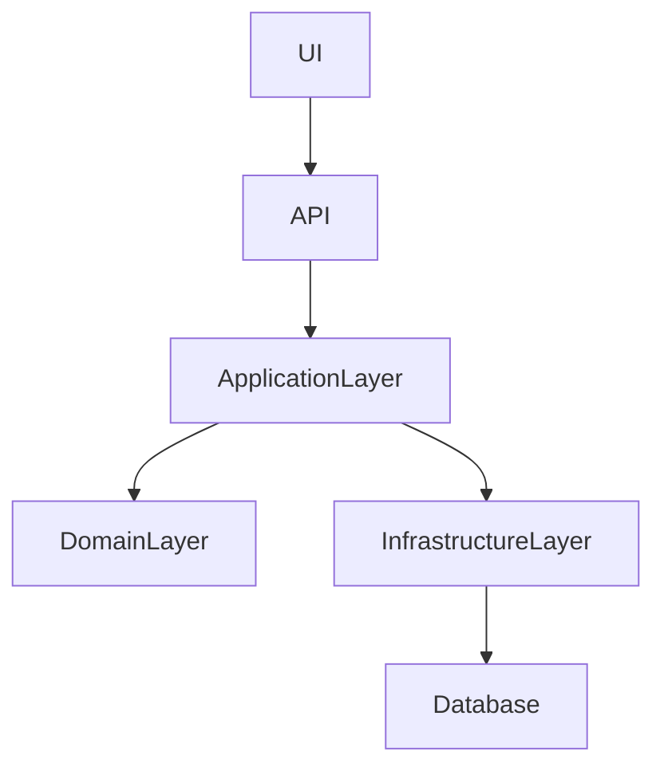

Why Clean Architecture:

Logistics rules evolve frequently. Clean architecture isolates business logic from frameworks allowing infrastructure changes without impacting domain logic.

---

# 8. Event Processing Flow

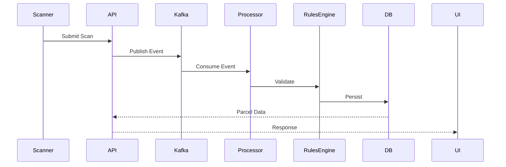

---

# 9. Parcel Lifecycle State Machine

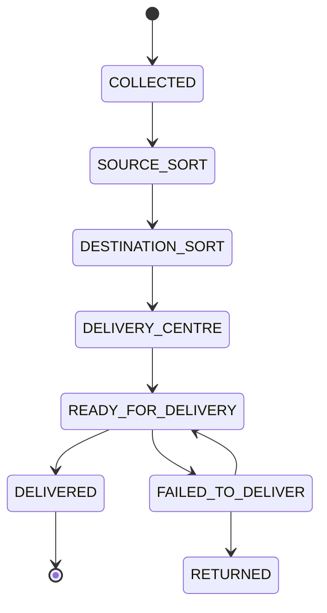

---

# 10. C4 Architecture Model

## Context Diagram

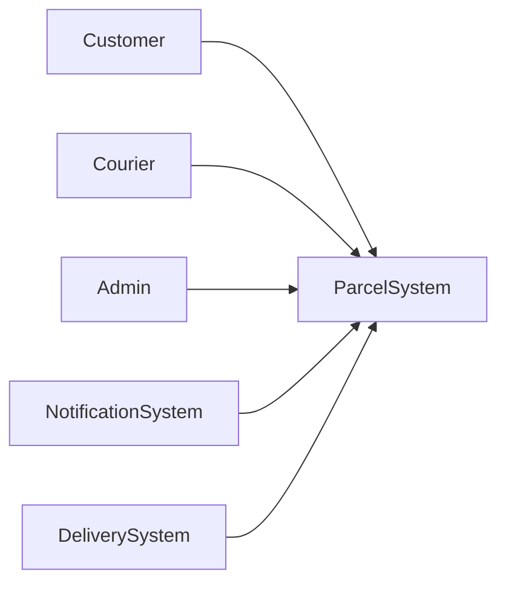

## Container Diagram

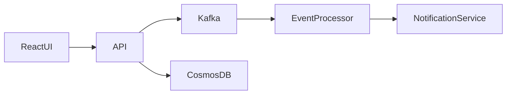

## Component Diagram

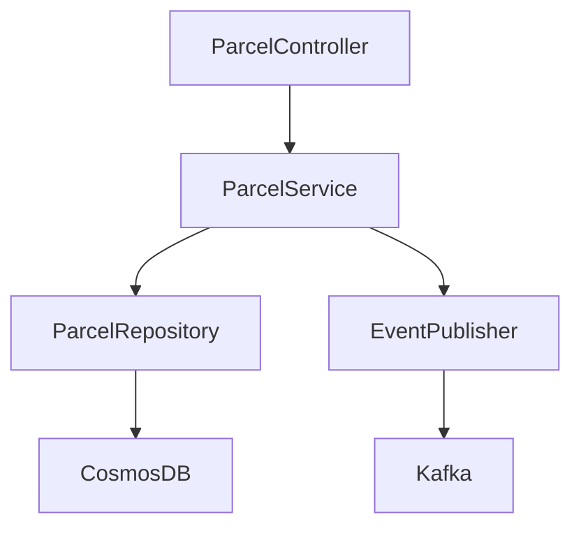

---

# 11. Data Model

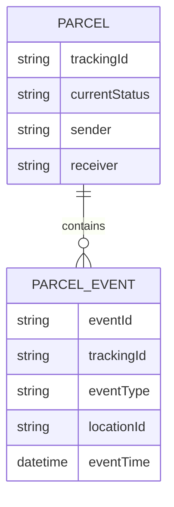

---

# 12. Kafka Cluster Topology

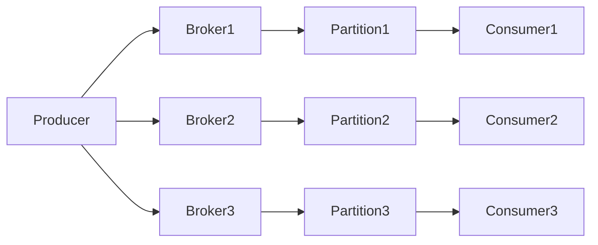

Benefits:

- distributed partitions
- consumer group scaling
- fault tolerance

---

# 13. API Gateway + CDN Architecture

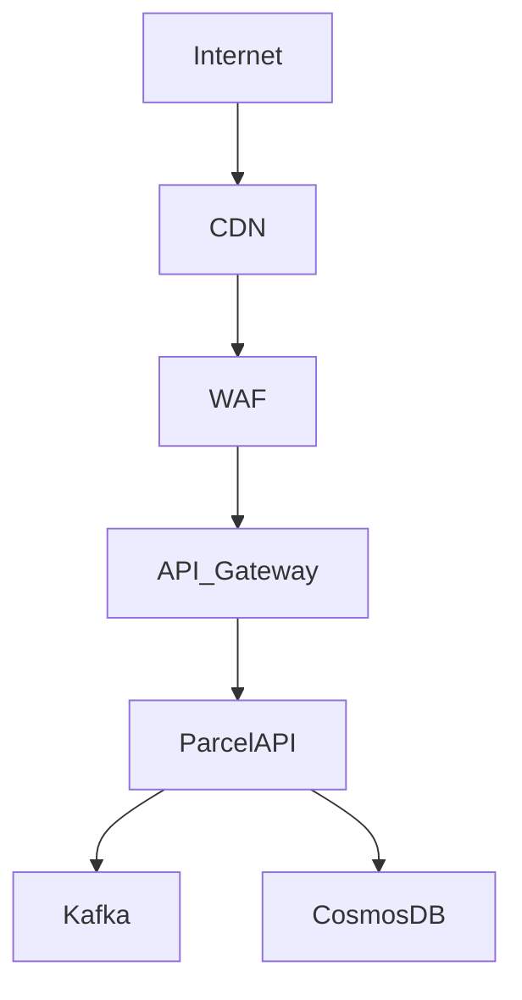

Benefits:

- global caching
- security filtering
- traffic management

---

# 14. Kubernetes Production Deployment

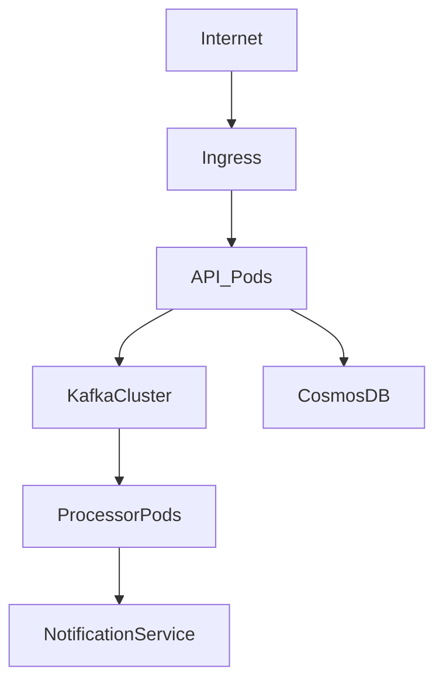

Benefits:

- container orchestration
- auto scaling
- self healing infrastructure

---

# 15. Event Replay Architecture

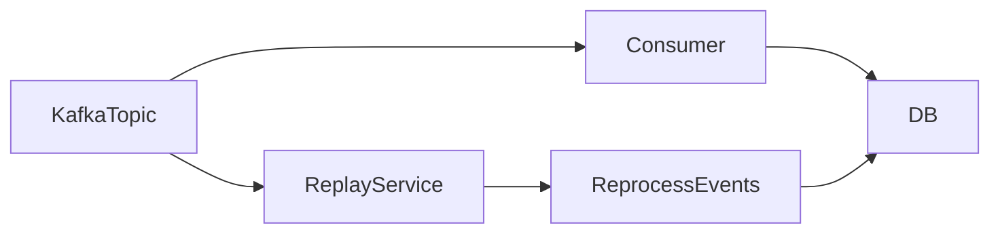

Benefits:

- rebuild projections
- recover corrupted states

---

# 16. Observability Pipeline

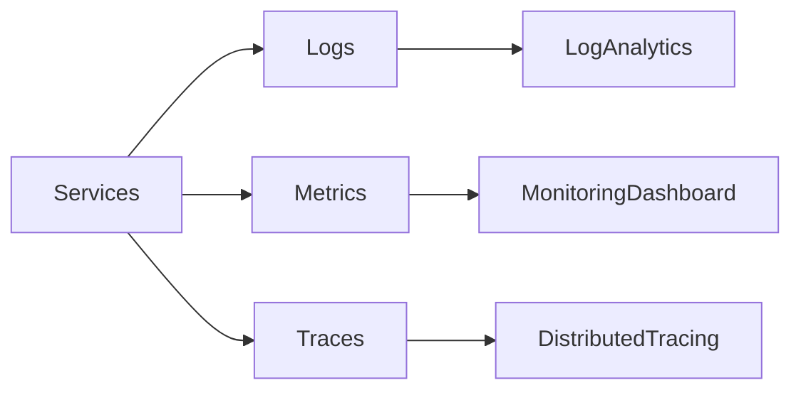

Monitoring Tools:

- Azure Monitor
- Application Insights
- Prometheus / Grafana

---

# 17. Load Testing Architecture

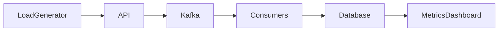

Tools:

- k6
- JMeter
- Locust

---

# 18. Cosmos DB Partition Strategy

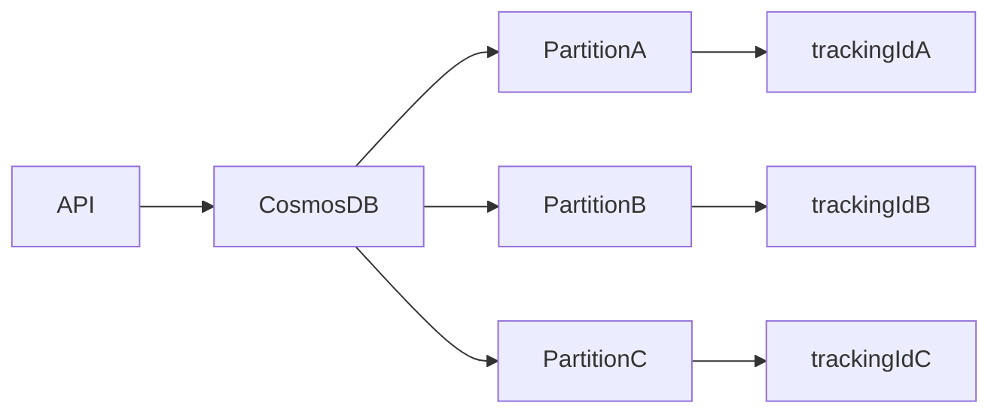

Partition Key:

`/trackingId`

---

# 19. Reliability Architecture

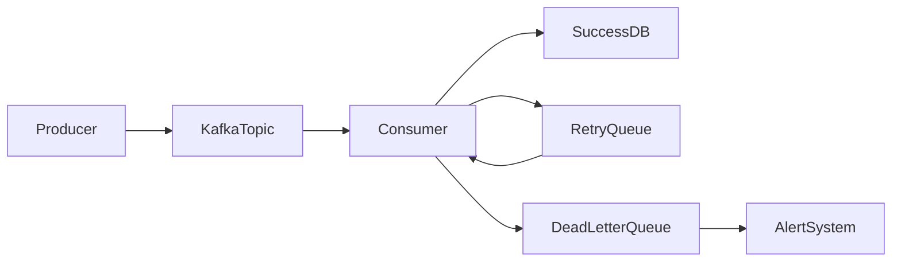

Reliability mechanisms:

- retries
- dead letter queues
- idempotent processing

---

# 20. Sample Test Payload

POST /api/scans

```json
{
 "trackingId": "TRK123456",
 "eventType": "COLLECTED",
 "locationId": "BLR_HUB",
 "eventTimeUtc": "2026-03-08T12:00:00Z",
 "actorId": "scanner-21"
}
```

---

 
